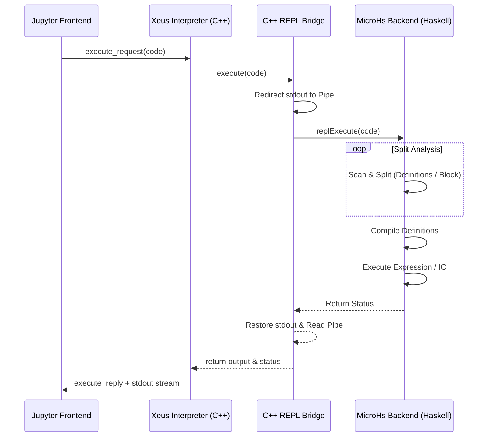
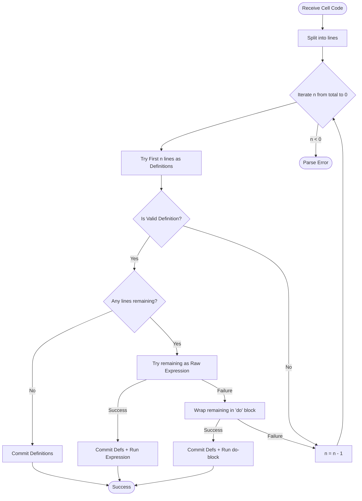

# MicroHs REPL Mechanism

This document provides a technical overview of how the REPL (Read-Eval-Print Loop) is implemented in `xeus-haskell`.

## Overview

Unlike kernels based on GHC, `xeus-haskell` leverages **MicroHs**, a minimal Haskell implementation. The REPL provides an incremental execution environment where state (definitions and types) is preserved across multiple Jupyter cells.

## Core Components

1. **`src/Repl.hs`**: The heart of the REPL logic, written in Haskell and compiled with MicroHs. It handles module construction, compilation, and execution.
2. **`src/mhs_repl.cpp`**: A C++ bridge that communicates with the Haskell logic via the Foreign Function Interface (FFI). It also manages standard output redirection to capture execution results.
3. **`src/xinterpreter.cpp`**: The `xeus` interpreter implementation that orchestrates the kernel lifecycle and delegates execution requests to the C++ bridge.

---

### High-Level Sequence



### 1. Mixed cell support (Scan and Split)

Unlike standard REPLs that might expect a single statement per line, `xeus-haskell` supports cells containing a mix of definitions and expressions. It applies a **Scan and Split** algorithm to determine the execution boundary:



1. **Greedy Prefix Search**: The kernel scans the cell line-by-line from the bottom up to find the largest prefix that forms a valid set of Haskell definitions.
2. **Definition Processing**: Any lines identified as definitions are appended to the persistent context and compiled.
3. **Expression Execution**: The remaining lines (the "execution block") are processed as follows:
    - **Raw Expression**: First, the kernel tries to parse the block as a single pure expression (e.g., `1 + 1`).
    - **Monadic `do`-wrapping**: If it's not a single expression, the kernel wraps the block in a `do` block (e.g., for multiple `putStrLn` calls) to allow sequential IO execution.

### 2. State Maintenance (The persistent Context)

State is maintained through a persistent `ReplCtx` structure in `Repl.hs`:

```haskell
data ReplCtx = ReplCtx
  { rcFlags :: Flags       -- Compilation flags
  , rcCache :: Cache       -- MicroHs compiler cache
  , rcDefs  :: [StoredDef]  -- List of user-defined snippets
  , rcSyms  :: Symbols     -- Persistent symbol tables for introspection
  }
```

#### Handling Definitions

When a definition is entered:

1. **Name Extraction**: The kernel identifies which names (identifiers) are being defined.
2. **Shadowing**: If a previous definition exists with the same name, it is stripped from `rcDefs` to simulate shadowing.
3. **Incremental Module**: All stored definitions are concatenated into a temporary source file (the "Inline" module).
4. **Cache Update**: The module is re-compiled, and the internal compiler cache is updated.

#### Handling Expressions

When an execution block is entered:

1. **Wrapping**: If the block was identified as requiring monadic execution, it is wrapped in an artificial `do` block and then placed into a temporary `runResult` function inside the "Inline" module.
2. **Execution wrapper**: It uses `_printOrRun` to correctly handle both pure values (printing them) and `IO` actions (executing them).
3. **Evaluation**: The temporary module is compiled and executed. Because the previous definitions in the same cell were already committed to the cache in the "Handling Definitions" phase, the expression has access to them immediately.

---

## Technical Details

### Standard Output Redirection

Since MicroHs writes directly to `stdout`, `xeus-haskell` implements a robust capture mechanism in C++. It creates a POSIX pipe (or Windows pipe) and duplicates the stdout file descriptor during the execution of a cell. This allows the kernel to intercept everything produced by `putStrLn`, `print`, or the `Display` system.

### Optimization: The Warmup Expression

During initialization, the `MicroHsRepl` constructor evaluates a trivial code snippet (`"0"`). This triggers the initial compilation of the `Prelude` and other standard libraries, caching them in the `Cache` to ensure subsequent cell executions are fast.

### Limitations

- **Selective Redefinition**: Because the kernel concatenates all previous definitions for every cell that adds a new definition, very large notebooks with hundreds of complex definitions may see a slight compilation slowdown.
- **MicroHs Boundaries**: Language features are limited to those supported by the MicroHs compiler (Haskell 2010 + some extensions). GHC-specific extensions (like `TypeApplications` or `GADTs`) are generally not available.

## Advanced Usage: The `Display` System

The REPL is integrated with the rich content protocol described in [COMMUNICATION.md](./COMMUNICATION.md). If an expression evaluates to a type that implements the `Display` typeclass, its output is automatically wrapped in the rich content markers and rendered as HTML, LaTeX, or Markdown in the notebook.
